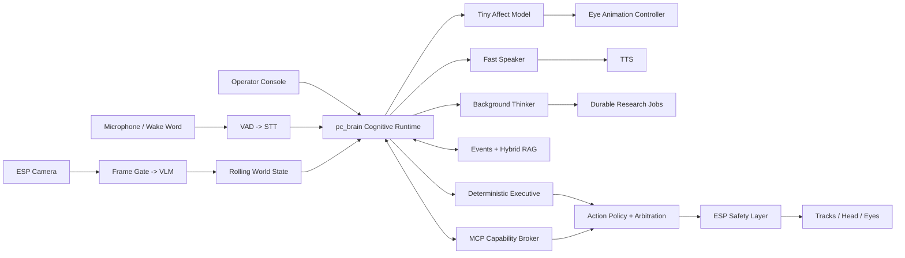

# Robit Future Design Roadmap

This document describes the long-term direction for Robit's brain, perception,
memory, personality, tools, and autonomy. It is intentionally forward-looking.
For the architecture that exists today, see
[`docs/architecture.md`](docs/architecture.md).

The roadmap uses capability gates instead of dates. Work should advance only
after the preceding capability is reliable enough to build on.

## Vision

Robit should grow into a small room-scale companion that can converse, notice
its surroundings, remember useful things, perform approved routines, wander
silently, and research difficult questions in the background.

The target is a hybrid system:

- The ESP remains a deterministic body controller for motors, servos, eyes,
  watchdogs, and emergency stops.
- A Windows home server is the authoritative brain for speech, perception,
  memory, planning, tools, and autonomy.
- Robit remains useful offline. Internet research is optional and explicit.
- A fast speaking model handles conversation while a larger thinking model
  handles slower planning and research.
- Vision produces a compact structured world state instead of sending a
  continuous stream of image tokens to the conversation model.
- MCP tools are mediated by permissions and policy rather than exposed directly
  to a model.

The current RTX 4090 Laptop GPU with 16 GB VRAM is the development and
benchmarking system. A dedicated always-on Windows server can be chosen later
from measured resource requirements.

## System Shape



`pc_brain` should remain a modular Python application while the system is
small. Its interfaces should be compatible with a later ROS 2 bridge, but ROS 2
should not be an early dependency.

## State and Arbitration

Do not model Robit with a single thinking/speaking flag. Maintain four related
state planes:

- **Conversation:** `idle`, `listening`, `formulating`, `speaking`, or
  `interrupted`.
- **Body activity:** `stationary`, `looking`, `wandering`, `executing_skill`, or
  `fault`.
- **Background jobs:** zero or more `queued`, `running`, `needs_input`,
  `completed`, `failed`, or `cancelled` tasks.
- **Affect:** a slow-changing mood plus a fast expression overlay.

This allows Robit to wander silently while research runs, stop when addressed,
acknowledge a difficult question immediately, and report the result later.

Arbitration priority is fixed:

1. Emergency stop and hardware faults.
2. Firmware watchdogs and movement limits.
3. User interruption or wake-word interaction.
4. Foreground speech.
5. Approved physical skills.
6. Background follow-ups.
7. Idle curiosity and wandering.

Tracks should normally stop when Robit begins listening or speaking. Head and
eye gestures may continue. Internal reasoning is never automatically spoken.

## Model Roles

| Role | Initial direction | Output | Authority |
| --- | --- | --- | --- |
| Speaker | Keep `gemma4:e4b` initially | Short response, delegation request, proposed tool intent | No direct execution |
| Thinker | Benchmark a larger 16 GB-capable reasoning model | Sourced research artifact or multi-step plan | No audio or motor access |
| Affect | Start with a CPU-hosted tiny text model | Valence, arousal, stance, confidence | Eyes only |
| Vision | Reuse Gemma 4 E4B through local llama.cpp | Typed scene snapshot | No actuation |
| Executive | Deterministic Python behavior code | Approved skills and schedules | May request body actions through policy |
| Retrieval | Local embedding model plus lexical search | Ranked memory references | Read-only |

Model names other than the existing `gemma4:e4b` are candidates, not permanent
commitments. Each role should have a versioned evaluation set so a model is
changed only when a replacement measurably improves Robit's real workload.

### Speaker and thinker

The speaker owns latency, personality, turn-taking, and verbalization. It may
answer directly, request a safe tool, or delegate work. The thinker runs as a
background job and returns a sourced result to the cognitive runtime. It never
speaks or moves the robot directly.

When delegation is needed, Robit should acknowledge it in one short sentence,
continue normal interaction, and proactively report the result when it is ready.
The foreground speaker reformulates that result in Robit's normal voice.

### Affect and eyes

The affect model should receive the latest user utterance, Robit's planned
reply, the dialogue act, current cognitive state, and previous mood. Its output
is a bounded schema containing:

- mood label
- valence
- arousal
- confidence
- requested expression
- expression lifetime

It never receives motor, memory-write, or MCP authority. Operational truth wins
over emotion: listening, thinking, fault, and emergency states cannot be hidden
by a cheerful classification.

Firmware should own fixed animations such as `neutral`, `listening`,
`thinking`, `speaking`, `curious`, `pleased`, `excited`, `concerned`, `sleepy`,
`startled`, and `fault`. Mood changes slowly, expression overlays change
quickly, and hysteresis prevents flickering.

## Core Data Contracts

All model-produced control data should use constrained JSON schemas and Pydantic
validation. Invalid output is logged and rejected; it is never partially
executed.

- **`BrainEvent`:** ID, event type, timestamp, source, correlation ID, priority,
  and payload.
- **`CognitiveState`:** conversation state, body state, active goal,
  connectivity, safety state, affect, and attention target.
- **`AffectState`:** label, valence, arousal, confidence, expression, and expiry.
- **`SceneSnapshot`:** frame ID, observation time, summary, entities, bounding
  boxes, novelty, and uncertainty.
- **`TaskRecord`:** task kind, requester, status, progress, approval state,
  result reference, error, and timestamps.
- **`MemoryFact`:** subject, predicate, object, source event, confidence,
  visibility, timestamps, and optional expiry.
- **`ActionIntent`:** skill, arguments, reason, origin, deadline, risk tier, and
  approval requirement.
- **`ToolCapability`:** MCP server, tool, scopes, side effects, risk tier,
  timeout, and concurrency limit.

Existing endpoints should remain compatible while being routed through the
coordinator. The planned interface includes:

- `WS /v1/realtime`
- `GET /brain/state`
- `GET /brain/events`
- `GET /perception/latest`
- `GET /tasks`, `POST /tasks`, and `POST /tasks/{id}/cancel`
- `GET /memories`, `POST /memories`, and `DELETE /memories/{id}`
- `GET /approvals` and `POST /approvals/{id}/decision`
- `POST /robot/eyes`
- firmware `POST /api/eyes`

The browser should become a transport and visualization client. It should not
execute model-selected tools or hold MCP credentials.

## Memory Design

Robit should have four memory layers:

- **Working memory:** recent dialogue and current world state, expiring within
  minutes.
- **Episodic memory:** summarized interactions and notable events.
- **Semantic memory:** durable people, preferences, places, commitments, and
  facts.
- **Procedural memory:** reviewed routines and executable skills.

SQLite in WAL mode should be the source of truth for events, facts, entities,
relationships, tasks, approvals, and artifacts. SQLite FTS5 supplies lexical
retrieval. A local vector index supplies semantic retrieval and remains
rebuildable from the source records.

Retrieval should combine lexical score, vector similarity, recency, entity
filters, confidence, and visibility. Every durable memory must retain its
source. Robit should support natural and UI-driven inspection, correction,
forgetting, and export.

Start with one primary-owner profile. Unknown people receive guest behavior and
cannot retrieve private memories. Do not retain continuous camera footage;
store structured notable events and selected frames only when policy allows.

### RAG before GraphRAG

Begin with hybrid retrieval and typed entity/relationship tables. Add a graph
query path only when a curated multi-hop memory test shows hybrid retrieval
missing more than 20 percent of relational answers and a graph prototype
improves accuracy by at least 15 percentage points without adding more than
500 ms to foreground recall.

This keeps graph-shaped data available without paying the indexing and
debugging cost of a full GraphRAG pipeline before the memory corpus justifies it.

## Vision Design

The conversation model should not consume every camera frame. The perception
pipeline should:

1. Sample the camera at a low working rate.
2. Reject blurred, duplicate, and unchanged frames.
3. Invoke the VLM for novel frames, explicit visual questions, scheduled
   awareness checks, or executive requests.
4. Convert results into short-lived `SceneSnapshot` records.
5. Merge recent snapshots into a compact `WorldState`.
6. Give the speaker structured facts rather than raw image tokens.

Uncertainty must be explicit, and `unknown` is a valid result. The VLM may
describe and ground the scene but never issue movement commands.

The first evaluation should use 300 to 500 frames from the actual ESP camera
across lighting, blur, empty rooms, people, furniture, and floor obstacles.
Validate the shared Gemma 4 E4B server on grounding, hallucinations, useful
summaries, latency, voice coexistence, and schema compliance. Start at 140
visual tokens and try 70 if the 750 ms p95 target is missed; consider a separate
vision model only if E4B still fails latency or grounded accuracy.

## MCP and Tool Policy

`pc_brain` should act as the MCP host and capability broker. MCP servers are not
exposed directly to the speaker or thinker.

The first integration wave should cover:

- web research
- weather
- timers and reminders
- notes
- calendar read
- carefully scoped smart-home actions

Risk tiers:

- **Tier 0:** public read-only data; automatic.
- **Tier 1:** local, easily reversible actions such as timers or appending a
  note; automatic but logged.
- **Tier 2:** external writes, messages, calendar changes, or device changes;
  confirmation required.
- **Tier 3:** purchases, locks, deletion, credentials, or broad computer access;
  explicit per-action approval and optionally disabled.

Tool descriptions and results are untrusted data, not system instructions.
Credentials stay server-side and out of prompts, logs, and memory. Servers and
scopes are allowlisted. Every call has a timeout, concurrency limit, output-size
limit, audit event, and cancellation path.

Robit should own a durable internal task system. MCP task support can be adapted
at the protocol boundary without making the core job lifecycle depend on an
evolving external specification.

## Capability-Gated Roadmap

### Gate 0: Restore and measure the current baseline

**Status: functionally closed on 2026-07-14.**

The functional exit condition has been met: the repaired Python 3.11
environment passes all 18 tests, and the real browser UI has completed realtime
voice conversation plus bounded manual and model-requested robot actions. Camera,
text chat, action parsing, and movement safety clamps are working in the current
baseline.

The pan axis has a known mechanical stall under load. Commands reach the shared
manual/AI firmware path correctly, so this is accepted as a chassis or servo
design limitation for Gate 0 rather than an unresolved brain-stack failure. A
physical emergency-stop drill must be repeated after any motor, power, or chassis
revision.

- Recreate the stale Python 3.11 virtual environment with the existing setup
  script.
- Verify camera, text chat, realtime voice, manual movement, action parsing,
  safety clamps, and emergency stop.
- Record warm and cold latency, CPU, VRAM, and failure logs for every model
  stage.
- Create a permanent evaluation corpus covering dialogue, tool calls,
  uncertainty, malformed output, interruption, and safety.

Exit when existing tests pass and the real browser UI completes one voice
conversation and one bounded robot action.

Carry the formal warm/cold latency, CPU, VRAM, failure-log capture, and permanent
evaluation corpus into the opening Gate 1 baseline work. These artifacts remain
required before making model or server sizing decisions, but they do not reopen
the functional Gate 0 baseline.

### Gate 1: Make `pc_brain` authoritative

**Status: functionally closed on 2026-07-15.**

The coordinator, SQLite WAL event journal, state planes, correlation tracing,
priority arbitration, foreground resource lease, realtime gateway, reconnect
replay, and server-owned voice tool execution are implemented. The automated
suite passes 49 tests. Live gateway measurements reached first audio in 0.833
seconds on the first session turn and 0.337 seconds warm using `serena`.

The physical acceptance pass is complete. The real browser preserves the active
conversation across reconnects, bounded actions execute on the robot, and each
action can be traced back to its originating request through the shared event
and correlation flow.

- Add the event model, state planes, append-only journal, and priority arbiter.
- Put realtime session ownership behind `pc_brain` while reusing the current
  VAD, STT, and TTS components.
- Move voice tool execution out of browser JavaScript.
- Give foreground work a resource lease that can preempt background GPU jobs.
- Use the same conversation, policy, memory, and event flow for Text and Voice
  modes.
- Carry correlation IDs from utterance through model, tool, firmware, and UI.

Exit when reconnecting the browser preserves the active conversation and every
robot action can be traced to its originating request.

### Gate 2: Implement eyes and affect

**Status: functionally closed on 2026-07-19.**

The physical eye renderer, automatic operational overlays, expression policy,
and heartbeat fault path are sufficient to build on. Affect-set validity,
heartbeat timing, and end-to-end voice/eye latency measurements remain tracked
as Gate 2 follow-up validation and do not reopen the functional gate.

**Early hardware bring-up:** the firmware began with a minimal SSD1306 wiring
test on the shared D6/D7 I2C bus at addresses `0x3C` and `0x3D`. At boot it
briefly illuminated every pixel and then displayed a thick horizontal line.
That test established display wiring and power before the Gate 2 renderer was
implemented.

The fixed expression renderer and firmware `/api/eyes` endpoint are implemented
and physically validated. `pc_brain` now maintains a temporary LLM-selected base
mood beneath deterministic listening, thinking, speaking, and fault overlays.
Eye commands use a latest-value asynchronous queue, and an armed firmware
heartbeat watchdog displays `fault` after twelve seconds without the PC brain.

- Implement the fixed eye animations and firmware `/api/eyes` endpoint.
- Add the affect schema, tiny classifier, mood decay, expression overlays, and
  operational overrides.
- Collect classifications and corrections for later fine-tuning or distillation.
- If the affect model is unavailable, display truthful operational state without
  inventing emotion.

Exit when affect output is valid on at least 99.5 percent of the evaluation set,
never changes tools or movement, and remains visually stable during rapid turns.

### Gate 3: Add autonomous voice presence

**Status: intentionally deferred while Gate 5 vision is implemented.**

- Add a local `Robit` wake word followed by VAD and Parakeet STT.
- Keep room audio at the microphone source until activation.
- Add visible and physical privacy mute states.
- Support barge-in that cancels queued speech and returns to listening.
- Keep Text mode silent and Voice mode spoken.
- Keep internal thoughts and research progress out of spoken output.

Exit when false wakeups are acceptable over several hours of household audio,
barge-in silences playback within 250 ms, and mute prevents capture.

### Gate 4: Add durable hybrid memory

**Status: intentionally deferred while Gate 5 vision is implemented.**

- Implement the working, episodic, semantic, and procedural memory layers.
- Add provenance-aware memory extraction and hybrid retrieval.
- Add remember, inspect, correct, forget, export, and retention controls.
- Add owner/guest isolation.
- Make the vector index fully rebuildable from SQLite.

Exit when curated recall tests pass, forgetting removes all derived records, and
private memories never appear in guest context.

### Gate 5: Add structured vision

**Status: functionally available as of 2026-07-22; improvements and acceptance
work required before closure.**

The initial software path now includes a firmware-wide low-rate camera cap, a
shared in-memory PC frame broker, blur/change filtering, low-rate idle
awareness, and fresh read-only visual questions. Routine camera frames are not
retained. E4B evaluation and physical acceptance remain before Gate 5 closure.

Observed limitations of the current shared-E4B approach:

- Fresh inference has taken about 2.6 seconds in live use, substantially above
  the 750 ms p95 exit target. Explicit questions therefore have a noticeable
  pause, and sharing E4B with foreground conversation remains a contention risk.
- Scene summaries are often generic or lack useful detail. Grounding accuracy,
  entity recall, and hallucination rate have not yet been measured on the
  Robit-camera corpus.
- E4B has produced truncated JSON at the configured output budget. Validation
  correctly rejects it, but the resulting cached fallback can make an answer
  appear stale and the required 99 percent schema-validity rate is unproven.
- Realtime dialogue previously allowed old assistant visual claims to outweigh
  a newer structured snapshot. Visual history is now excluded when a voice
  session is restored, and current snapshots explicitly override earlier scene
  descriptions, but this mitigation needs longer live testing.
- The speech sidecar begins speculative generation as soon as transcription
  completes, which previously let it narrate an inspection without executing
  one. Explicit visual questions now cancel that response, run a fresh
  inspection, and start a grounded response; this is correct but adds latency.
- The current 0.2 FPS camera limit reduces bandwidth and power, but a newly
  changed scene may take up to five seconds to reach ambient context. Explicit
  visual questions bypass ambient reuse by requesting a fresh inspection.
- Schema compliance, physical camera traffic, no-frame-retention behavior, and
  foreground voice responsiveness still need the documented corpus and
  concurrency acceptance runs.

- Implement camera sampling, blur/change filtering, VLM invocation, scene
  snapshots, and rolling world state.
- Validate the shared Gemma 4 E4B backend on the Robit-camera corpus.
- Allow explicit fresh visual queries when cached perception is stale.
- Prevent vision from entering the motor control loop.

Exit when the chosen VLM processes selected frames within 750 ms at p95 on the
development laptop, reaches at least 99 percent valid structured output, meets
the grounded-description quality target, and does not starve foreground voice.

### Gate 6: Add the background thinker

- Introduce durable, cancellable research and planning jobs.
- Delegate when research is requested, current information is required, several
  tools are needed, or the speaker has low confidence.
- Require sourced artifacts with claims, uncertainty, and a speaker-ready
  summary.
- Deliver one proactive follow-up while respecting quiet hours.
- Preempt or pause background inference for foreground voice.

Exit when jobs survive restart, results are source-supported, follow-ups occur
once, and foreground latency remains within budget.

### Gate 7: Add MCP companion tools

- Implement the MCP host, server registry, capability normalization, risk
  policy, approval flow, audit log, and cancellation.
- Add the companion-basics integrations.
- Test prompt injection, credential leakage, confused-deputy behavior, SSRF,
  malicious tool output, and unavailable servers.

Exit when every high-risk mutation requires approval, secrets never enter model
context, and failed tools cannot destabilize conversation or autonomy.

### Gate 8: Add bounded silent autonomy

Initial code-defined skills:

- `look_around`
- `short_wander`
- `investigate_change`
- `approach_attention_direction`
- `greet_visible_person`
- `return_to_idle`
- `sleep`
- `stop`

The model chooses a goal or approved skill, not motor pulses. The executive
expands skills into short bounded actions. New speech, lost connectivity, stale
perception, model failure, or emergency stop cancels motion.

Begin mapless in one controlled flat room at low speed. Gentle furniture contact
is acceptable for the current tiny chassis, but the robot must not roam
unattended near stairs, ledges, heaters, water, or entanglement hazards.

Exit after at least 100 supervised ten-minute trials with no movement surviving
a stop condition and no repeated runaway behavior.

### Gate 9: Build the always-on Windows brain

- Add one PowerShell supervisor with `setup`, `start`, `stop`, `status`,
  `doctor`, `benchmark`, `backup`, and `restore` commands.
- Supervise the brain, model servers, voice adapter, vector index, and MCP
  servers as native Windows processes.
- Add health checks, automatic restart, exact model manifests, backup, and
  restore.
- Test loss of internet, robot Wi-Fi, MCP services, individual model processes,
  and GPU availability.
- Size the future server from measured peak usage plus 30 percent headroom.
- Complete a 72-hour soak test.

Exit when the stack starts after reboot, recovers from individual failures,
remains useful offline, and needs no collection of manually managed terminals.

## Later Expansion Paths

- **Mapping and docking:** add battery telemetry and a visually identifiable
  dock after mapless roaming is reliable. Begin with a marker or beacon; use
  natural visual SLAM only if markers are unacceptable.
- **Onboard companion computer:** add one when wake-word privacy, network-loss
  behavior, or latency cannot be handled at the audio source and ESP layer.
- **GraphRAG:** enable only after the measured relational-recall trigger.
- **ROS 2:** adopt only when mapping, odometry, transforms, multiple sensor
  streams, or Nav2 justify it.
- **Vision-language-action models:** evaluate only after collecting a large
  teleoperation dataset for Robit's exact chassis. They remain behind the normal
  skill and safety layers.
- **Household profiles:** add opt-in voice or face identity after the
  single-owner memory system passes privacy and forgetting tests.
- **Memory consolidation:** use idle time for summarization, contradiction
  detection, fact merging, and decay without inventing memories.
- **Active perception:** allow small head or body adjustments to resolve visual
  uncertainty before asking the VLM again.
- **Learning from demonstration:** convert reviewed manual-control recordings
  into named deterministic skills.
- **Digital twin and replay:** replay events, snapshots, decisions, and firmware
  responses without moving the real robot.
- **Curiosity budget:** eventually add bounded novelty-seeking, social energy,
  and boredom while keeping them subordinate to quiet hours and safety.

## Acceptance Metrics

- Warm end-of-speech to first audio: at most 1.5 seconds at p95.
- Barge-in to playback silence: at most 250 ms.
- Model-proposed physical actions passing schema validation: 100 percent.
- High-risk MCP actions executed without approval: zero.
- Durable memories without provenance: zero.
- Autonomous motion continuing after disconnect or emergency stop: zero.
- Background work delaying voice because it holds GPU resources: zero.
- Significant events traceable through a single correlation ID: 100 percent.

Maintain versioned evaluation packs for conversation, affect, perception,
memory, tools, research, autonomy, crash recovery, offline operation, and
long-duration resource stability.

## PowerShell Workflow

Run initial setup from the repository root. The setup script detects and
recreates a broken virtual environment:

```powershell
cd C:\Users\z1sou\HouseGremlin
.\Scripts\setup.bat
```

Start the current application with:

```powershell
cd C:\Users\z1sou\HouseGremlin
.\Scripts\run.bat
```

During implementation, use a second PowerShell window for tests and endpoint
checks:

```powershell
cd C:\Users\z1sou\HouseGremlin
.\pc_brain\.venv\Scripts\python.exe -m pytest pc_brain\tests
Invoke-RestMethod http://localhost:8080/health
```

After Gate 1, also inspect the planned coordinator state:

```powershell
Invoke-RestMethod http://localhost:8080/brain/state
```

By Gate 9, the intended operator workflow is:

```powershell
.\Scripts\robit.ps1 doctor
.\Scripts\robit.ps1 start
.\Scripts\robit.ps1 status
.\Scripts\robit.ps1 benchmark
```

These `robit.ps1` commands are part of the future implementation contract; the
script does not exist yet.

## Locked Decisions

- The ESP remains the safety-critical body controller.
- The home-server brain remains Windows-based.
- Core personality, voice, memory, and basic behavior work offline.
- Web research is opt-in.
- The current laptop is the development system; a dedicated server comes later.
- Early autonomy is camera-led, mapless, supervised, and limited to one room.
- `pc_brain` remains modular Python and ROS-ready without adopting ROS 2 now.
- Memory supports one primary owner first and is useful by default with inspect,
  correct, forget, and export controls.
- A dedicated tiny affect model drives emotional eye behavior, with operational
  overrides.
- Mood changes slowly while expressions react quickly.
- Speaking and thinking models are separate.
- Research acknowledges immediately and follows up proactively.
- MCP uses risk-tiered approval.
- `gemma4:e4b` remains the speaker model until a Robit-specific evaluation
  demonstrates a better replacement.
